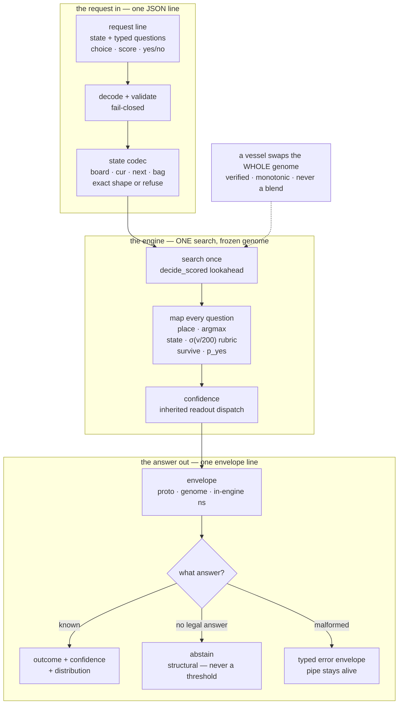
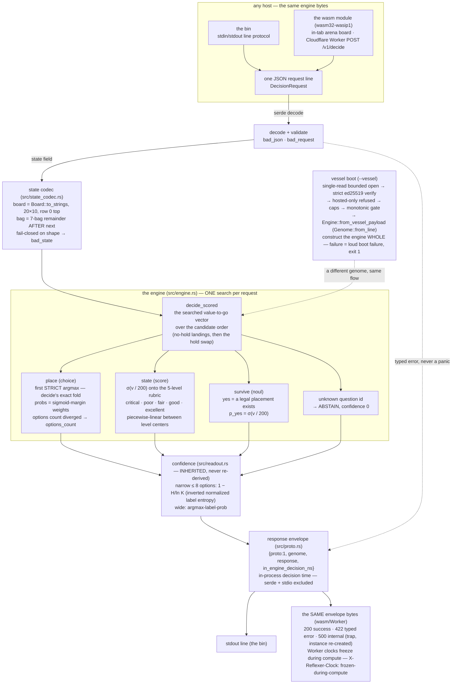

# Decision flow — the one diagram (hero + annotated)

> **Purpose:** the one diagram that shows what reflexer IS end to end — the
> public decision ENGINE: a typed request line in, ONE frozen-genome search,
> a typed answer (or an honest abstain, or a typed error) out as one
> envelope line, bit-identical on every host. The compact source below
> renders `decision_flow.svg`, the hero figure this book carries.

Two renders exist:

- **The hero SVG** — `decision_flow.svg`, rendered from the COMPACT
  source below (short labels: it must read at a glance).
- **The annotated diagram** — the full mermaid in this doc, with the
  honest edge-by-edge reading. The source of truth for what the engine
  actually does (`src/engine.rs` module doc is the code-level authority;
  this doc is the picture).

## The compact hero source (renders `decision_flow.svg`)

Three bands: the request in on top, the engine (one search) in the middle,
the answer out under it; the vessel boot dotted in from the side.



## The annotated source (full detail)



## What each edge means (honest reading)

- **ONE search answers a whole request.** Every question kind maps onto the
  same searched vector (`katgpt_tetris::rulebook::decide_scored`) — the
  value-to-go is computed once per request and every answer reads it. That
  is the wire law (`Engine::answer`), and it is why the envelope's single
  `in_engine_decision_ns` covers all questions.
- **place is bit-identity, by construction.** Options are the EXACT
  candidate order of `decide_scored` (no-hold landing options first, then
  the hold swap, labeled `h{0|1}i{index}`); the outcome index is the first
  STRICT argmax — the same fold `decide` is — so wire-driven games are
  bit-identical to `play_game`. A client whose option COUNT diverges gets
  a typed `options_count` refusal, never a silently-misaligned index
  (fail-closed bit-identity defense). Probabilities are sigmoid-margin
  weights at the population-std scale — sigmoid, never softmax.
- **state and survive read the same scalar.** The position's value-to-go
  through σ(v/`V_REF`=200) onto the canonical 5-level rubric
  (piecewise-linear between level centers); `survive`'s yes is the
  structural fact "a legal placement exists", its `p_yes` the same σ(v/200).
- **abstention is STRUCTURAL, never a threshold.** Unknown question id →
  ABSTAIN (confidence 0); no candidates (top out) → `place` abstains,
  `state` scores critical, `survive` answers no. A confidence threshold
  would sit inside game replay and break bit-identity with the substrate
  battery — "cannot answer" is the honest answer, first-class on this wire.
- **confidence is inherited, not re-derived.** The Bench-817 dispatch
  (katgpt-rs; the same inheritance riir-reflex's readout carries):
  narrow (≤ 8 options) = inverted normalized label entropy; wide =
  argmax-label-prob. Changing the bound is a policy edit, never a
  re-derivation.
- **errors are typed and the pipe stays alive.** `bad_json` ·
  `bad_request` · `bad_state` · `question_kind` · `options_count` ·
  `internal` — malformed input answers an error envelope, never a panic
  (and under `panic=abort` — every wasm build — the host re-creates the
  instance and answers `internal` itself). EOF exits 0.
- **the envelope is the measurement.** `in_engine_decision_ns` excludes
  serde + stdio: render it beside the round trip, never display a sub-ms
  decision through same-size subprocess overhead. On the Worker the clock
  freezes during compute (`X-Reflexer-Clock: frozen-during-compute`), so
  the caller's round trip is the honest latency.
- **one engine, three hosts, same bytes.** The bin's stdio loop, the
  in-tab arena board, and the Cloudflare Worker all answer the SAME
  envelope line (`serve::handle_line` is the transport-free core; the
  Worker's responses are gated line-for-line against the bin by
  `tests/serve_parity.rs`).
- **the vessel edge swaps the genome, nothing else.** A vessel is verified
  (strict ed25519, single-read bounded open), refused if hosted-only or
  off the monotonic gate, bound through `Genome::from_line` — the
  whole-snapshot wire, NEVER a weighted blend (blends do not preserve move
  rankings) — and the engine is constructed WHOLE before serving. Every
  vessel failure is a loud boot failure (exit 1); there is no silent
  fallback to the compiled champion.
- **sigmoid is delegated to the substrate** (`katgpt_core::exact_sigmoid_f64`):
  admissible because the G1 pin is pick-level (decision sequences, stats,
  genome id) — the wire consumes `Outcome::Choice { index }`, never the
  probabilities. The permanent arm
  `sigmoid_delegation_matches_frozen_legacy_body` reds if the substrate
  kernel ever drifts.

## Degenerate states (all honest)

- Top out (no legal placement) → `place` ABSTAINS, `state` scores
  critical, `survive` answers no — structural, per-question.
- Unknown question id → ABSTAIN, confidence 0.
- Malformed line / bad state / wrong kind / diverged options count → the
  typed error envelope; the pipe stays alive for the next line.
- A vessel that fails any gate → loud boot failure (exit 1); the bin never
  falls back silently.

## Re-rendering the hero SVG

The SVG is rendered from the COMPACT source above (the block carrying the
`%% file:` / `%% aria:` headers) with the fleet renderer —
`../reflex-site/scripts/render_flows.py` (the mermaid path via mermaid.ink,
the gist.rs web-family palette, the Reflex-family accent `#ff8a3d`: this
engine is the arena's *Reflex · rulebook* lane). This figure is not among
the renderer's `SOURCES` (the repo's mirrored figure is
`06_resources/resources.md`'s relation flow), so re-render locally and
commit the doc + the SVG together — the doc block is the source of truth,
never hand-edit the SVG:

```sh
python3 - <<'PY'
import sys
sys.path.insert(0, "../reflex-site/scripts")   # the fleet renderer
import render_flows as rf
from pathlib import Path

doc = Path(".docs/03_decision_flow")
md = (doc / "decision_flow.md").read_text(encoding="utf-8")
for file, aria, code in rf.blocks(md, headered_only=True):
    svg = rf.postprocess(rf.render_mermaid(code, rf.theme_for("family:#ff8a3d")), file, aria)
    (doc / file).write_text(svg, encoding="utf-8", newline="\n")
    print(f"rendered {file} ({len(svg)} B)")
PY
```

(A site mirror for THIS figure would be a reflex-site decision — and by
the family gate's shrink-only mermaid pin, it would have to land as a
`gfflow` block, not this mermaid source; the repo's mirrored figure today
is the relation flow in `06_resources/`.)

## Refs

- `src/engine.rs` module doc — the code-level pipeline authority (the
  question mapping + the abstention law)
- `src/proto.rs` — the line envelopes + error codes
- `src/state_codec.rs` — the wire state schema
- `src/readout.rs` — the inherited confidence dispatch
- `src/serve.rs` — the transport-free line core shared by every host
- `02_wire_protocol/measurement_contract.md` — the full wire contract
- `04_vessel_format/vessel_format.md` — the vessel boot path in detail
- `.benchmarks/001_p2_engine_bin_gates.md` — the G1/G2 gate record
- Pattern sibling: `../riir-reflex/.docs/03_decision_flow/decision_flow.md`
  (the doc-first → SVG pattern this file follows)
